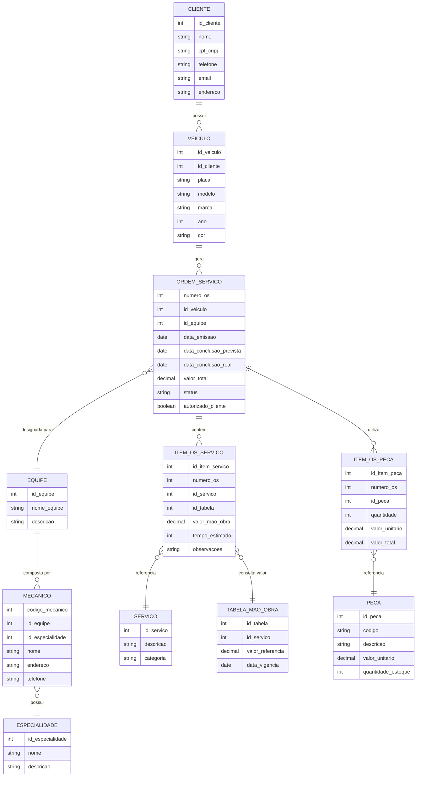

# 🔧 Sistema de Gerenciamento de Oficina Mecânica

## 📋 Descrição do Projeto

Este é um modelo conceitual de banco de dados para um **Sistema de Controle e Gerenciamento de Ordens de Serviço** em uma oficina mecânica. O sistema foi projetado para gerenciar todo o fluxo de trabalho, desde a chegada do cliente até a conclusão dos serviços.

## 🎯 Objetivo

Criar um esquema conceitual completo que permita:
- Cadastro de clientes e veículos
- Gerenciamento de equipes e mecânicos especializados
- Controle de ordens de serviço (OS)
- Cálculo automático de valores (mão de obra + peças)
- Acompanhamento do status dos serviços
- Autorização do cliente para execução

## 📖 Narrativa do Sistema

O sistema contempla o seguinte fluxo de trabalho:

1. **Clientes** levam seus **veículos** à oficina para consertos ou revisões periódicas
2. Cada **veículo** é designado a uma **equipe de mecânicos**
3. A equipe identifica os **serviços** necessários e preenche uma **Ordem de Serviço (OS)**
4. O **valor da mão de obra** é calculado consultando a **Tabela de Referência**
5. O **valor das peças** é adicionado à OS
6. O **cliente autoriza** a execução dos serviços
7. A **mesma equipe** avalia e executa os serviços até a conclusão

## 🗂️ Modelo Entidade-Relacionamento

## 🏗️ Estrutura das Entidades

### 👤 CLIENTE
Armazena informações dos clientes da oficina.
- **Atributos principais**: nome, CPF/CNPJ, telefone, email, endereço
- **Relacionamento**: Um cliente pode possuir múltiplos veículos

### 🚗 VEICULO
Cadastro dos veículos dos clientes.
- **Atributos principais**: placa (identificador único), modelo, marca, ano, cor
- **Relacionamento**: Pertence a um cliente e pode ter várias ordens de serviço

### 📝 ORDEM_SERVICO (OS)
Documento principal que controla todo o processo de atendimento.
- **Atributos principais**:
  - `numero_os`: Número único da ordem de serviço
  - `data_emissao`: Data de abertura da OS
  - `data_conclusao_prevista`: Prazo estimado para entrega
  - `data_conclusao_real`: Data efetiva de conclusão
  - `valor_total`: Valor total (serviços + peças)
  - `status`: Situação atual (Aberta, Em Andamento, Aguardando Autorização, Concluída, Cancelada)
  - `autorizado_cliente`: Flag indicando se o cliente autorizou os serviços

### 👥 EQUIPE
Representa as equipes de trabalho da oficina.
- **Atributos**: nome da equipe, descrição
- **Relacionamento**: Composta por vários mecânicos e responsável por múltiplas OSs

### 🔧 MECANICO
Profissionais que executam os serviços.
- **Atributos principais**: código, nome, endereço, especialidade
- **Relacionamento**: Pertence a uma equipe e possui uma especialidade

### ⚙️ ESPECIALIDADE
Categorização das habilidades dos mecânicos.
- **Exemplos**: Motor, Suspensão, Freios, Elétrica, Ar Condicionado, Funilaria
- **Relacionamento**: Múltiplos mecânicos podem ter a mesma especialidade

### 🛠️ SERVICO
Catálogo de serviços oferecidos pela oficina.
- **Exemplos**: Troca de óleo, Alinhamento, Balanceamento, Revisão de freios
- **Atributos**: descrição, categoria
- **Relacionamento**: Referenciado nos itens de serviço da OS

### 💰 TABELA_MAO_OBRA
Tabela de preços de referência para mão de obra.
- **Atributos**: valor de referência por serviço, data de vigência
- **Propósito**: Padronizar valores e manter histórico de preços
- **Relacionamento**: Consultada ao adicionar serviços na OS

### 🔩 PECA
Catálogo de peças disponíveis.
- **Atributos**: código, descrição, valor unitário, quantidade em estoque
- **Relacionamento**: Utilizada nos itens de peça da OS

### 📊 ITEM_OS_SERVICO
Detalha os serviços incluídos em cada OS.
- **Atributos**: valor da mão de obra, tempo estimado, observações
- **Relacionamento**: Conecta OS, Serviço e Tabela de Mão de Obra

### 🧩 ITEM_OS_PECA
Detalha as peças utilizadas em cada OS.
- **Atributos**: quantidade, valor unitário, valor total
- **Cálculo**: `valor_total = quantidade × valor_unitario`

## 📐 Regras de Negócio

1. **Cliente e Veículo**
   - Um cliente pode ter múltiplos veículos
   - Um veículo pertence a apenas um cliente

2. **Ordem de Serviço**
   - Cada OS é única e identificada por um número
   - Uma OS está vinculada a apenas um veículo
   - Uma OS é designada para uma única equipe
   - O status da OS deve ser atualizado conforme o progresso

3. **Equipe e Mecânicos**
   - Uma equipe pode ter vários mecânicos
   - Um mecânico pertence a uma equipe (pode ser ajustado para múltiplas equipes)
   - Cada mecânico possui uma especialidade
   - A mesma equipe que avalia é responsável pela execução

4. **Serviços e Valores**
   - O valor da mão de obra é consultado na Tabela de Referência
   - Cada item de serviço pode ter um valor diferente do tabelado (descontos/acréscimos)
   - O valor total da OS = Σ(valores dos serviços) + Σ(valores das peças)

5. **Autorização**
   - Os serviços só podem ser executados após autorização do cliente
   - A flag `autorizado_cliente` controla essa regra

6. **Peças**
   - O sistema controla estoque de peças
   - O valor das peças é registrado no momento da inclusão na OS

## 🔍 Decisões de Modelagem

Durante a criação do modelo conceitual, foram tomadas as seguintes decisões baseadas na compreensão do contexto:

### 1. **Relacionamento Mecânico-Equipe**
- **Decisão**: Um mecânico pertence a uma equipe por vez
- **Justificativa**: Simplifica o gerenciamento e controle de responsabilidades
- **Alternativa**: Poderia ser N:N se mecânicos trabalhassem em múltiplas equipes

### 2. **Especialidade dos Mecânicos**
- **Decisão**: Criada como entidade separada
- **Justificativa**: Permite padronização e facilita relatórios por especialidade
- **Não mencionado na narrativa**: Assumido como necessário para organização

### 3. **Status da Ordem de Serviço**
- **Decisão**: Valores sugeridos: "Aberta", "Em Andamento", "Aguardando Autorização", "Concluída", "Cancelada"
- **Justificativa**: Controle completo do ciclo de vida da OS

### 4. **Tabela de Referência de Mão de Obra**
- **Decisão**: Incluído campo `data_vigencia`
- **Justificativa**: Permite histórico de preços e reajustes
- **Não mencionado na narrativa**: Assumido como boa prática

### 5. **Autorização do Cliente**
- **Decisão**: Campo booleano `autorizado_cliente` na OS
- **Justificativa**: Controle de permissão para início dos trabalhos

### 6. **Separação de Itens (Serviços e Peças)**
- **Decisão**: Duas entidades distintas (ITEM_OS_SERVICO e ITEM_OS_PECA)
- **Justificativa**: Diferentes atributos e regras de negócio para cada tipo

### 7. **Cliente com CPF ou CNPJ**
- **Decisão**: Campo único `cpf_cnpj`
- **Justificativa**: Simplificação do modelo conceitual
- **Alternativa**: Poderia ser separado em CLIENTE_PF e CLIENTE_PJ

## 🚀 Próximos Passos

Para evoluir este modelo conceitual para os níveis lógico e físico:

1. **Modelo Lógico**
   - Definir chaves primárias (PKs) e estrangeiras (FKs)
   - Especificar cardinalidades exatas
   - Aplicar normalização (1FN, 2FN, 3FN)
   - Definir constraints e regras de integridade

2. **Modelo Físico**
   - Escolher SGBD (MySQL, PostgreSQL, etc.)
   - Definir tipos de dados específicos
   - Criar índices para otimização
   - Definir procedures e triggers
   - Implementar controle de acesso

## 🛠️ Tecnologias Utilizadas

- **Modelagem**: Mermaid (ERD)
- **Documentação**: Markdown
- **Versionamento**: Git/GitHub

## 👨‍💻 Autor

Modelo conceitual desenvolvido como parte do desafio de projeto de Banco de Dados.

---

## 📄 Licença

Este projeto está sob a licença MIT. Sinta-se livre para utilizá-lo e adaptá-lo conforme necessário.
